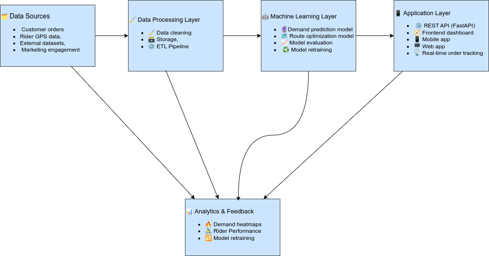
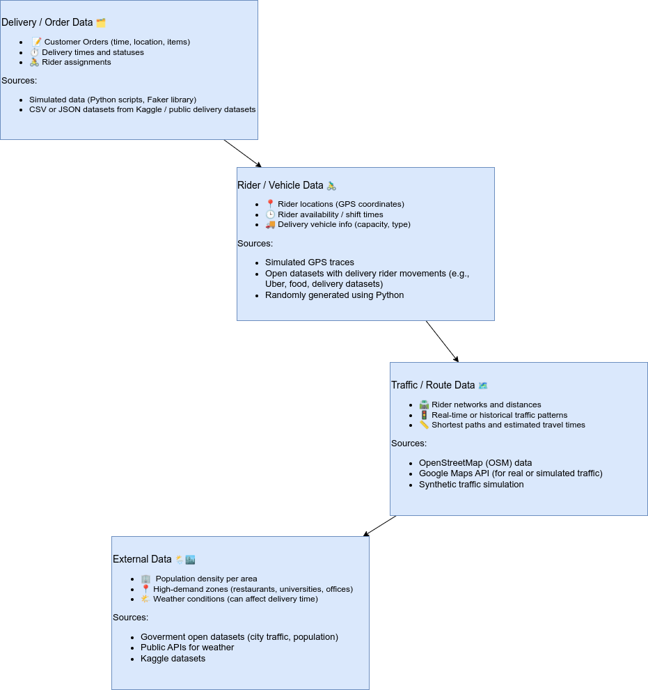

# AI-Driven Last-Mile Logistics Optimization

## Project Overview

This project simulates real-world logistics data to optimize last-mile
delivery operations for small and medium enterprises (SMEs). Using Python,
data engineering techniques, and machine learning, it analyzes delivery patterns,
identifies traffic congestion, and suggests shorter or alternative routes for riders.  

The goal is to improve delivery efficiency, reduce fuel and time costs, and help small
businesses scale their logistics operations intelligently.

This project also served as a compulsory graduation task for the MIT Emerging Talent program, allowing me to apply practical skills in data engineering and machine learning to a real-world logistics problem.

---

## Motivation

The idea for this project comes from my undergraduate experience founding Tomori Foods,
a small food business in Nigeria.  

From the start, I faced real logistical challenges — managing deliveries, unreliable suppliers,
and delayed payments. My teammates, Fola and Harun, handled graphics and web development, while
I managed logistics and customer relations. Despite our efforts, deliveries remained a huge challenge:
students wanted products delivered directly, but we had no reliable system or optimized routes.  

I often wished for a platform designed specifically for small businesses — one that could automatically
assign riders, plan optimal delivery paths, and monitor traffic in real time.  

This project simulates delivery data for SMEs and explores how AI-driven route optimization can make
small-scale logistics smarter, faster, and more affordable.

---

## Objectives

- Simulate real-world delivery and traffic data for SMEs.  
- Use Python and machine learning to optimize delivery routes.  
- Build a dynamic system that updates routes in real time when traffic conditions change.  
- Provide visualizations to compare actual vs. optimized delivery performance.

---

## Features

- **Route Optimization:** Suggests shorter or faster delivery paths.  
- **Traffic Simulation:** Generates and updates synthetic traffic data.  
- **Dynamic Re-Routing:** Automatically recommends new routes when delays occur.  
- **Delivery Analytics Dashboard:** Visualizes delivery time, cost savings, and performance metrics.  

---

## System Architecture

Below is the high-level architecture of the platform:

## Data Architecture

## Tools & Technologies

- **Programming & Libraries:** Python (pandas, NumPy, scikit-learn)  
- **Maps & Routing:** OpenStreetMap, Google Maps API (for live or simulated data)  
- **Visualization:** Matplotlib, Plotly  
- **Development Environment:** Jupyter Notebook, Streamlit (for demo/dashboard)  

---

## Competitor Analysis

Several delivery platforms exist, such as **Chowdeck**, which provide last-mile services in Nigeria.
They are strong in:

- High-volume delivery  
- Fast fulfillment (under 30 minutes)  
- Dark-store infrastructure (warehouses optimized for online order fulfillment)  
- Vendor integrations  

### Why This Platform Stands Out

- **Dynamic Route Optimization:** Adjusts routes in real time based on traffic and demand.  
- **ML-Driven Demand Prediction:** Allocates riders efficiently by anticipating high-demand zones.  
- **Automatic Rider Notifications:** Ensures faster deliveries and reduced delays.  
- **Scalable & Modular:** Can handle more riders and zones without manual intervention.

This positions our system not just as another delivery service, but as a
**data-driven optimization and automation engine** for last-mile logistics that can be adopted,
adapted, and scaled for more efficient operations.

---

## Acknowledgments

I am grateful to my peers from Tomori Foods, whose collaboration and resilience inspired this project.
Their support motivated me to keep seeking innovative ways to empower small businesses through data, AI, and automation.
